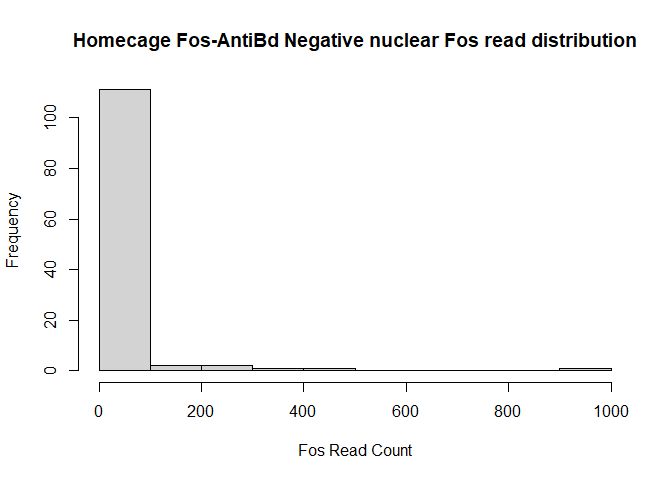
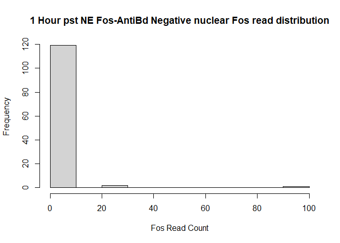
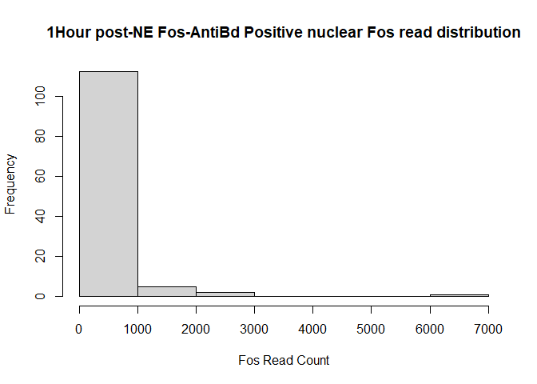
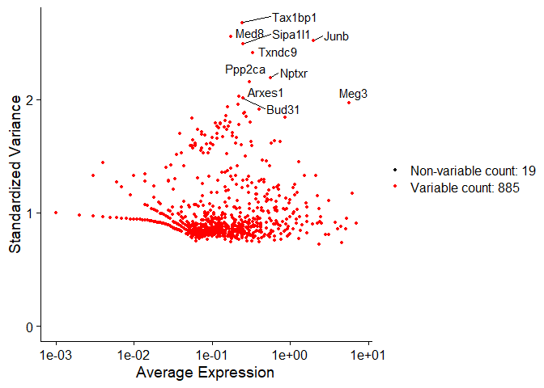
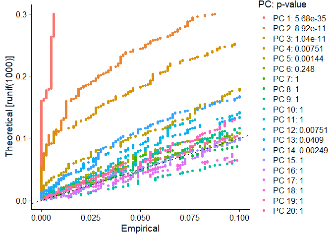
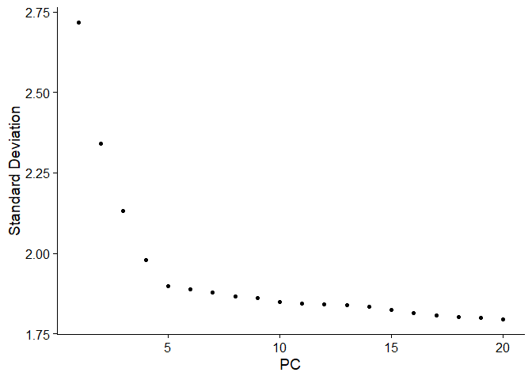
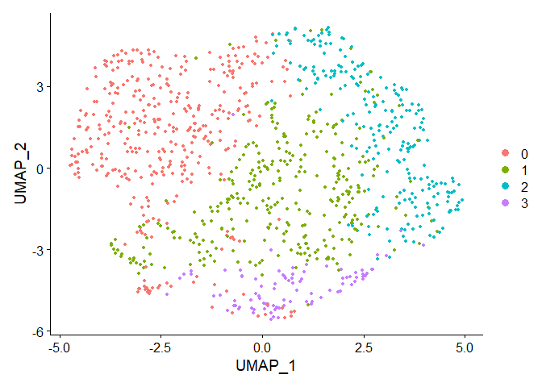
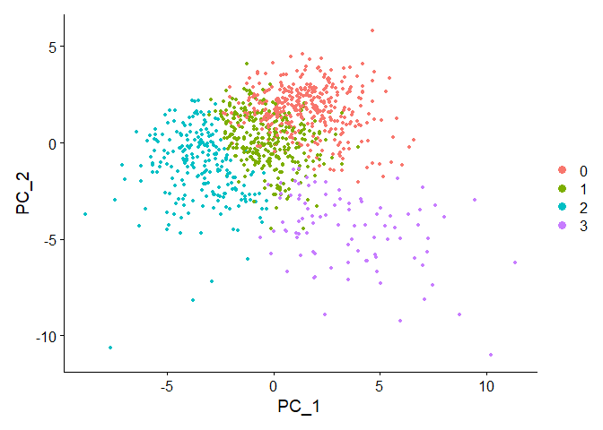
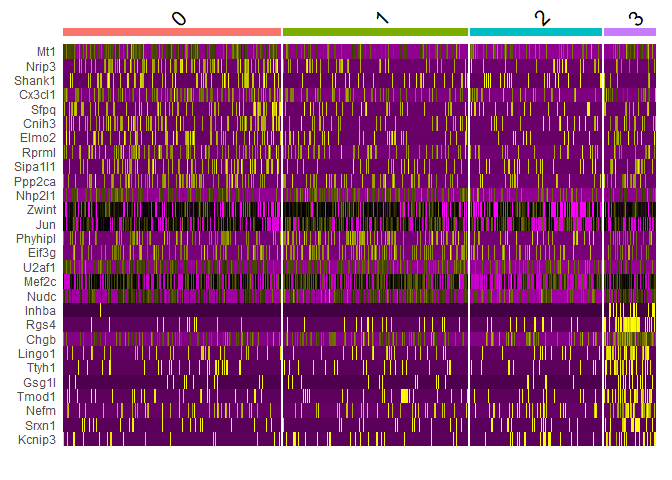

Jeager Engram Cell Gene signatures in other datasets
================
Angus Campbell
11/02/2022

## Introduction

Here I have used supplemental data 4 from Jeager et al., (2018) which is
a list of the DEGs from Fos+ dentate granule cells (DGCs) at various
time points vs Fos- DGCs at various time points. They assignmened these
DEGs to qualitatively similar time courses. While not rigorous it is
interesting to look at and perhaps gives us an opportunity to do a more
rigorous analysis ourselves and generate a better time course annotation
for these IEGs. I use this DEG list to cluster DGCs from the first
expeirment of Hochgerner et al., (2018). This second dataset of \~5k
cells was sampled from mlae and female mice across development. The
sample of interest for me were samples from post natal day 37 which is
relatively close to the 7-8.75 week old mice (in days they are
\~P49-P62) in Jeager. Though not an ideal match it is better than the
other dataset which contains 24k cells but range from emryonic mice to
post natal day 120 and 132. Jeager et al. (2018) was done entirely using
female mice while Hochgerner was done with a mixture of males and
females.

The Hochgerner dataset contains some peculiarities. They have pooled
cells between males and females to reduce batch effects, but its
difficult to guess which cells came from which. Hochgerner et al.,
(2018) assigned sex to cells based on number of male vs female genes in
each cell. They provide metadata about the number fo males and females
pooled for the batch each cell was drawn from but in the post natal days
24 and 35 in the Hoch5k data there are some that simply cannot be known.

### Jeager et al., (2018) meta data and counts

Load Jeager data.

``` r
jeager2018_counts <- bind_cols(read.table('Jeager2018_GSE98679/GSE98679_count.txt.gz', header = TRUE, check.names = FALSE),
                               read.table('Jeager2018_GSE98679/GSE98679_v2_GSM3308862-GSM3309413_count.txt.gz', header = TRUE, check.names = FALSE))

jeager2018_meta <- read.csv('Jeager2018_GSE98679/SraRunTable.txt', header = TRUE)
jeager2018_meta = jeager2018_meta[c(1:46,599:912,47:598),] #we need to fix Jeager's files up a bit
rownames(jeager2018_meta) <- c(1:912)

jeager2018_meta$predicted_cell_type <- as.character(lapply(jeager2018_meta$predicted_cell_type, function(x) if (x=="") {"DG"} else {x}))
jeager2018_meta$predicted_cell_type <- lapply(jeager2018_meta$predicted_cell_type, function(x) if (x=="") {"DG"} else {x})

jeager2018_meta$fos_status <- as.factor(sapply(as.character(jeager2018_meta$source_name), function(y) if (grepl("_F_", y, fixed=TRUE)) "Fos+" else "Fos-"  ))
jeager2018_meta$fos_status[361:dim(jeager2018_meta)[1]] <- "Fos+"

jeager2018_meta$Mouse_Number[c(361:912)] <- jeager2018_meta$mousingle_number[c(361:912)]
jeager2018_meta <- jeager2018_meta %>% 
  dplyr::select(-mousingle_number)

#filtering out cells as per instructions in Jeager et al., 2018)
under4k <- sapply(jeager2018_counts, function(y) sum(length(which(y>0))))

filtered.idx <- as.numeric(which(under4k>4000))
filtered.idx <- order(c(filtered.idx,194))

jeager2018_counts <-jeager2018_counts[,filtered.idx]
jeager2018_meta <- jeager2018_meta[filtered.idx,]
```

### Getting a handle on realsitic Fos levels in Jeager

<br><br> Quick check for HC DGCs with fos labelleing. <br>

``` r
which((jeager2018_meta$exposure=="HC")&(jeager2018_meta$fos_status=="Fos+"))
```

    ## integer(0)

<br><br> So no data on that but let’s get an idea for what the IEG
distribution was like in Jeager’s experiments. <br><br>

``` r
jeager.fos.idx <- which(rownames(jeager2018_counts)=="Fos")
fosneg.HC <- which((jeager2018_meta$exposure=="HC")&(jeager2018_meta$fos_status=="Fos-"))

hist(as.numeric(jeager2018_counts[jeager.fos.idx, fosneg.HC]), 
     main = "Homecage Fos-AntiBd Negative nuclear Fos read distribution",
     xlab = "Fos Read Count")
```

<!-- -->
<br>

``` r
fosneg.1hr <- which((jeager2018_meta$exposure=="1hr")&(jeager2018_meta$fos_status=="Fos-"))


hist(as.numeric(jeager2018_counts[jeager.fos.idx, fosneg.1hr]), 
     main = "1 Hour pst NE Fos-AntiBd Negative nuclear Fos read distribution",
     xlab = "Fos Read Count")
```

<!-- -->

``` r
fospos.1hr <- which((jeager2018_meta$exposure=="1hr")&(jeager2018_meta$fos_status=="Fos+"))

hist(as.numeric(jeager2018_counts[jeager.fos.idx, fospos.1hr]),
     main = "1Hour post-NE Fos-AntiBd Positive nuclear Fos read distribution",
     xlab = "Fos Read Count") 
```

<!-- -->
<br> So in general there are a few cells with a low level expression of
fos, and then this small group of outliers in with a high fos count.
THis is in line with the sparse coding of events observed in the brain.
<br> <br>

## Looking for Engram labelling gene’s in Hochgerner et al., (2018) at P35

<br> <br> This section is basically just copy pasta from [Seurats
tutorials](https://satijalab.org/seurat/articles/pbmc3k_tutorial.html).
Here I am using the DEGs published by Jeager et al., (2018). When I
attempted this clustering using all the gene’s in the Hochgerner5k
dataset nothing came up. I successfully identify engram cells here with
the restricted gene list. So what we are seing here are not primary
drivers of variance relative to most genes, even within the cell type
matching the Jeager data at a similar developmental timepoint. We will
need to address this later in the work. But here what I end up finding
is a realtively rare cell type, defined by expression of 1hr markers as
well as markers that last from 1hr to 5hrs. <br> <br>

``` r
#loading the 5k dataset
# for now I think it is best to keep it seperate from the 24k data as it has only half the genes
# of the 
testsetpath <- "C:/Users/angus/Desktop/test_datasets"

hochgerner5k_2018_counts <- read.table(paste(testsetpath,"/Hochgerner2018/GSE95315_10X_expression_data_v2.tab.gz", sep=""))

colnames(hochgerner5k_2018_counts) <- hochgerner5k_2018_counts[1,]
rownames(hochgerner5k_2018_counts) <- hochgerner5k_2018_counts[,1]

hochgerner5k_2018_meta <- hochgerner5k_2018_counts %>% 
  dplyr::slice(c(1:3)) %>%
  t() %>%
  data.frame %>%
  dplyr::slice(-1) %>% 
  dplyr::select(-cellid)

hochgerner5k_2018_counts <- hochgerner5k_2018_counts %>% 
  dplyr::select(-cellid) %>% 
  dplyr::slice(-c(1:3))


#Load Jeagers DEGs and Check which genes are shared

Jeager.DEGs <- read.csv("Jeager2018_GSE98679/jeager_DEGs_grouped.csv", header = T)

colnames(Jeager.DEGs)[1] <- "GeneID"

DEGs.idx <- Jeager.DEGs$GeneID

DEGs.idx <- DEGs.idx[(DEGs.idx %in% rownames(hochgerner5k_2018_counts))& (DEGs.idx %in% rownames(jeager2018_counts))]

Jeager.DEGs <- Jeager.DEGs[Jeager.DEGs$GeneID %in% DEGs.idx,]

#get index locations of these gene's in the other datasets
Jeager.DEGs$hoch5k.idx <- which(rownames(hochgerner5k_2018_counts) %in% Jeager.DEGs$GeneID)
hoch5k.GC_Adult.p35.idx <- (hochgerner5k_2018_meta$age.days.=="35") | (hochgerner5k_2018_meta$age.days.=="35*")
hoch5k.GC_Adult.p35.idx <- (hoch5k.GC_Adult.p35.idx) & (hochgerner5k_2018_meta$cluster_name == "Granule-mature")
hoch5k.GC_Adult.p35.idx <- which(hoch5k.GC_Adult.p35.idx)


#create seurat object jsut for the Hoch 5k data
Hoch5k.GCadult <- CreateSeuratObject(counts = hochgerner5k_2018_counts[Jeager.DEGs$hoch5k.idx, hoch5k.GC_Adult.p35.idx])
Hoch5k.GCadult
```

    ## An object of class Seurat 
    ## 904 features across 1014 samples within 1 assay 
    ## Active assay: RNA (904 features, 0 variable features)

<br><br> So in the tutorial it also says 0 variable features so I geuss
that’s ok. <br><br>

``` r
#QC for mitochondrial genes, like them we will remove any thing graeter than 5%
Hoch5k.GCadult[["percent.mt"]] <- PercentageFeatureSet(Hoch5k.GCadult, pattern = "^MT-")

# This is for the filerting out those with features that 
# I'm not sure what the appropriate number for us is, in the tutorial there were 13700 nfeatures
#and the filterd out cells with less then 200 and greater than 2500, so I geuss  cells with more than
# a quarter of nFeatures and less than 10% of that is unacceptable?  
Hoch5k.GCadult <- subset(Hoch5k.GCadult, subset = nFeature_RNA > 20 & nFeature_RNA < 250 & percent.mt < 5)

#note I am going to skip some QC steps here, but we do need to do that in the future
Hoch5k.GCadult <- NormalizeData(Hoch5k.GCadult)
Hoch5k.GCadult <- FindVariableFeatures(Hoch5k.GCadult)
```

``` r
top10 <-  head(VariableFeatures(Hoch5k.GCadult), 10)
plot1 <- VariableFeaturePlot(Hoch5k.GCadult)
plot2 <- LabelPoints(plot = plot1, points = top10, repel = TRUE)
```

    ## When using repel, set xnudge and ynudge to 0 for optimal results

``` r
plot2
```

    ## Warning: Transformation introduced infinite values in continuous x-axis

    ## Warning: Removed 19 rows containing missing values (geom_point).

<!-- -->

``` r
top10
```

    ##  [1] "Tax1bp1" "Med8"    "Junb"    "Sipa1l1" "Txndc9"  "Nptxr"   "Ppp2ca" 
    ##  [8] "Arxes1"  "Bud31"   "Meg3"

``` r
Jeager.DEGs$group.number[Jeager.DEGs$GeneID %in% top10]
```

    ##  [1] 6 3 3 3 3 4 4 2 2 2

``` r
Jeager.DEGs$group[Jeager.DEGs$GeneID %in% top10]
```

    ##  [1] "1hr_and_4hr" "4hr"         "4hr"         "4hr"         "4hr"        
    ##  [6] "4hr_and_5hr" "4hr_and_5hr" "5hr"         "5hr"         "5hr"

<br> <br>

The top most variable gene’s here are gene’s that are expressed later in
the timecourse of Jeager, this would make sense as they are all in
groups which express later. This is promissing as you would expect more
persistent IEGs and secondary response gene’s to be what we find rather
than gene’s like *Fos* that track moment to moment changes in activity.
I don’t want to make too much of this but these gene’s make sense to be
invovled in LTP, *Junb* forms part of the AP-1 trnascription factor
complex (Raivich et al. 2004). Meg3\* activates p53 and is a tumor
suppressor gene (Zhou et al., 2003), it is also intriguingly subject to
alternate splicing and searching the [isoform
atlas](https://noush-joglekar.shinyapps.io/spatialviz/) created by the
BRAIN initiative shows these isoforms appear to have variable expression
across the hippocampus (Joglekar et al., 2021). *Sipa1l1* is invovled in
[chemical synapse
transmission](https://www.genecards.org/cgi-bin/carddisp.pl?gene=SIPA1L1).

<br> <br>

``` r
#scaling for dimnesionality reduction
all.genes <- rownames(Hoch5k.GCadult)
Hoch5k.GCadult <- ScaleData(Hoch5k.GCadult, features = all.genes)
```

    ## Centering and scaling data matrix

``` r
Hoch5k.GCadult <- RunPCA(Hoch5k.GCadult , features = VariableFeatures(object = Hoch5k.GCadult),
                         npcs = 20) 
```

    ## PC_ 1 
    ## Positive:  Inhba, Lingo1, Eif5a, Rgs4, Rpl21, Ensa, Saraf, Chgb, Jund, Hpcal4 
    ##     Capzb, Mrps26, Rplp0, Ckb, 2010300C02Rik, Nptxr, Abr, Tpt1, Vdac1, Ptprn 
    ##     Atp5d, Synpo, Timm13, Zwint, Clta, Nrxn2, Mt1, Slc7a14, Dnaja2, Dock3 
    ## Negative:  Ppm1h, Lars2, Myo9b, Msantd2, Ascc3, Rrp1b, St7, Junb, Ralgapa1, Ryr1 
    ##     Psme4, Ttf1, Mknk2, Klhl32, 5031439G07Rik, Tfdp1, Ppp1r8, Sez6, Lrfn2, Ppp1r15b 
    ##     Rgs2, Zmym2, Prdm10, Acad10, Zfp51, Chga, Pxmp4, Lrrc8a, Arhgef40, Trpm2 
    ## PC_ 2 
    ## Positive:  Rpsa, Rplp0, Nrip3, Rps14, Rpl4, Rps18, Rpl41, Gm13889, Pfn1, Amd1 
    ##     Cfl1, Mt1, Spns2, Arpc2, Dclk1, Eef2, Rprml, Ptma, Rps11, Eif5 
    ##     Hnrnpa2b1, Rpl19, Rgs7bp, Rwdd3, Timm13, Atp5d, Cct5, Ybx1, Hsp90ab1, Erh 
    ## Negative:  Rgs4, Chgb, Inhba, Nptx2, Lingo1, Nefm, Trnp1, Sgk1, Ptprn, Shisa4 
    ##     Ier5, Ttyh1, Pdzd2, Kctd1, Zfp804a, Srxn1, Kcnk1, Sorcs3, Kcnip3, Syne1 
    ##     Rgs6, Tmod1, Nrxn3, Plekha2, Gsg1l, Dock3, Meg3, Sv2c, Mapk4, Bdnf 
    ## PC_ 3 
    ## Positive:  Aldoa, Rpl7, Rpl10, Zwint, Rps14, Junb, Hspa8, Rpl21, Jun, Fos 
    ##     Rpl4, Ensa, Rpl17, Nhp2l1, Eif5a, Ptma, Clta, Oat, Rpl19, Txnl1 
    ##     Eif4a1, Nudc, Hnrnpk, Csmd1, Sf3b1, Cfl1, Fosb, Gadd45g, Erh, Prdx5 
    ## Negative:  Nrxn2, Epha10, Pmepa1, Cnih3, Wipf3, Nrip3, Nrp1, 2010300C02Rik, Trim9, Per2 
    ##     Ncs1, Dclk1, Abr, Erdr1, Ildr2, Dot1l, Cyfip2, Fam53b, Wbscr17, Slc6a17 
    ##     Arc, Cntn5, Mkl1, Iqsec3, Mt2, Bms1, Dlgap3, Synj1, Ppm1h, Neat1 
    ## PC_ 4 
    ## Positive:  Rpl10, Rpl19, Rpl17, Slc30a3, Rps14, Tom1l2, Tnpo3, Phyhip, Plekhg5, Ppm1h 
    ##     Ice1, Rpl7, Oaz1, Tacc1, Syne1, Hspa8, Rnf19a, Chgb, Cacna1a, Rpl41 
    ##     Ncs1, Aldoa, Gm26981, Nptx1, Mrps26, Lmo7, Daglb, Txlng, Gba, Sec61a2 
    ## Negative:  Junb, Egr1, Fos, Fosb, Gadd45g, Gadd45b, Arc, Btg2, Rasd1, Per2 
    ##     Gm13889, Elmo1, Egr4, Stmn4, Ubc, Arl4d, Pdia6, Midn, Pdzd2, Jun 
    ##     Tmem151b, Srsf5, Numbl, Vgf, Lingo1, Pde4a, Rasl11a, Rgs2, Rangap1, Clstn3 
    ## PC_ 5 
    ## Positive:  Tspan31, Ddhd1, Atf4, Aldoa, Rps14, Oaz1, Rpl41, Ap2b1, Neat1, Midn 
    ##     Cenpa, Sorcs3, Dcaf13, Dhps, Nolc1, Cct5, Nptx1, Ppp1r16b, Samd4, Mnt 
    ##     Pdzd2, Sin3b, Kcnf1, Ywhag, Top1, Dlgap3, P4ha1, Ptma, Rpl22l1, Glce 
    ## Negative:  Usp14, Gprasp1, Srsf6, Crtac1, Rnf19a, Scg2, Bms1, Pxmp4, Galnt9, Kif1a 
    ##     Mapre1, Cct2, Morf4l2, Nptxr, Car10, Dusp4, Nop56, Hax1, Dlg2, Pcnx 
    ##     Agpat4, Chga, Pdia6, Cacna1a, Efna1, Snx17, Usp36, Mak16, Syt4, Myh9

<br> <br>

``` r
#Dsicovering dimensionality of these activity markers
Hoch5k.GCadult <- JackStraw(Hoch5k.GCadult, num.replicate = 100)
Hoch5k.GCadult <- ScoreJackStraw(Hoch5k.GCadult, dims = 1:20)
```

<br> <br>

``` r
JackStrawPlot(Hoch5k.GCadult, dims = 1:20)
```

    ## Warning: Removed 15273 rows containing missing values (geom_point).

<!-- -->
<br> <br> Up to Pc3 we see decently significance, though later we get 4
cluster, though tow of them are barely distinguishable and posses
basically no activity dependent markers (Jeager DEGs whihc could serve
as markers. <br> <br>

``` r
ElbowPlot(Hoch5k.GCadult)
```

<!-- -->
<br> <br> Shows more or less the same thing, 4 isn’t quite at the elbow
but it may as well be. I played with the QC thresholds and if you
increase the number of max nFeatures to high you will reduce to a single
PC. <br> <br>

``` r
#Adding metadata to identify the 
Hoch5k.GCadult <- AddMetaData(object = Hoch5k.GCadult, 
                               metadata = hochgerner5k_2018_meta[ hoch5k.GC_Adult.p35.idx, ])

#Clustering, we will visualize in UMP later
Hoch5k.GCadult <- FindNeighbors(Hoch5k.GCadult, dims = 1:3)
```

    ## Computing nearest neighbor graph

    ## Computing SNN

``` r
Hoch5k.GCadult <- FindClusters(Hoch5k.GCadult, resolution = 0.2)
```

    ## Modularity Optimizer version 1.3.0 by Ludo Waltman and Nees Jan van Eck
    ## 
    ## Number of nodes: 1005
    ## Number of edges: 26665
    ## 
    ## Running Louvain algorithm...
    ## Maximum modularity in 10 random starts: 0.8472
    ## Number of communities: 4
    ## Elapsed time: 0 seconds

``` r
Hoch5k.GCadult <- RunUMAP(Hoch5k.GCadult, dims = 1:4)
```

    ## Warning: The default method for RunUMAP has changed from calling Python UMAP via reticulate to the R-native UWOT using the cosine metric
    ## To use Python UMAP via reticulate, set umap.method to 'umap-learn' and metric to 'correlation'
    ## This message will be shown once per session

    ## 17:34:54 UMAP embedding parameters a = 0.9922 b = 1.112

    ## 17:34:54 Read 1005 rows and found 4 numeric columns

    ## 17:34:54 Using Annoy for neighbor search, n_neighbors = 30

    ## 17:34:54 Building Annoy index with metric = cosine, n_trees = 50

    ## 0%   10   20   30   40   50   60   70   80   90   100%

    ## [----|----|----|----|----|----|----|----|----|----|

    ## **************************************************|
    ## 17:34:54 Writing NN index file to temp file C:\Users\angus\AppData\Local\Temp\Rtmp2RY2G8\file11785c2270a1
    ## 17:34:54 Searching Annoy index using 1 thread, search_k = 3000
    ## 17:34:55 Annoy recall = 100%
    ## 17:34:56 Commencing smooth kNN distance calibration using 1 thread
    ## 17:34:58 Initializing from normalized Laplacian + noise
    ## 17:34:58 Commencing optimization for 500 epochs, with 33062 positive edges
    ## 17:35:05 Optimization finished

``` r
DimPlot(Hoch5k.GCadult, reduction ="umap")
```

<!-- -->
<br> <br> So what we get out of this is some kind of graded expression
within the population. It would be interesting to try to see which cells
have more of which gene group in them. This is similar to what was
described by Dr. Cembrowski’s group in Erwin et al., (2020) see figure 5
A in particular. I tried in with 3 dims and I think it looks better with
4 more graded less like swiss cheese. it would be interesting to see how
Jeager’s group labels map onto this. <br> <br>

``` r
#Lets find some markers 
cluster0.markers <- FindMarkers(Hoch5k.GCadult, ident.1 = 0, min.pct = 0.25)
head(cluster0.markers, n = 10)
```

    ##               p_val avg_log2FC pct.1 pct.2    p_val_adj
    ## Mt1    2.368503e-13  0.6645100 0.592 0.296 2.141126e-10
    ## Dclk1  2.171014e-08  0.4624195 0.598 0.356 1.962596e-05
    ## Nrip3  5.070522e-08  0.7177929 0.316 0.153 4.583752e-05
    ## Wipf3  5.452045e-08  0.4282538 0.550 0.326 4.928649e-05
    ## Rpsa   1.014128e-07  0.3373895 0.925 0.744 9.167719e-05
    ## Shank1 2.237663e-07  0.7516540 0.255 0.116 2.022847e-04
    ## Rplp0  2.983387e-07  0.2711950 0.976 0.873 2.696982e-04
    ## Cx3cl1 4.243815e-07  0.6126373 0.416 0.237 3.836409e-04
    ## Chgb   4.426409e-07 -1.0006962 0.263 0.378 4.001473e-04
    ## Nrxn2  9.949274e-07  0.4467206 0.501 0.305 8.994144e-04

``` r
cluster1.markers <- FindMarkers(Hoch5k.GCadult, ident.1 = 1, min.pct = 0.25)
head(cluster1.markers, n = 10)
```

    ##                p_val avg_log2FC pct.1 pct.2   p_val_adj
    ## Nhp2l1  7.614811e-06  0.4467243 0.492 0.358 0.006883789
    ## Mt1     1.608078e-05 -0.6190746 0.303 0.453 0.014537023
    ## Zwint   6.816639e-05  0.3132642 0.823 0.724 0.061622414
    ## Jun     3.539273e-04  0.3377622 0.722 0.664 0.319950269
    ## Phyhipl 4.283929e-04  0.4042125 0.312 0.225 0.387267172
    ## Nrxn2   5.980011e-04 -0.4515938 0.290 0.419 0.540593020
    ## Eif3g   1.006923e-03  0.4414896 0.338 0.241 0.910257971
    ## U2af1   1.925934e-03  0.2770874 0.489 0.401 1.000000000
    ## Mef2c   2.321402e-03  0.2658012 0.681 0.612 1.000000000
    ## Slc30a3 3.661277e-03 -0.4750338 0.202 0.299 1.000000000

``` r
cluster2.markers <- FindMarkers(Hoch5k.GCadult, ident.1 = 2, min.pct = 0.25)
head(cluster2.markers, n = 10)
```

    ##                p_val avg_log2FC pct.1 pct.2    p_val_adj
    ## Rplp0   9.065252e-07 -0.3221458 0.743 0.960 0.0008194988
    ## Ckb     1.327963e-06 -0.4555413 0.252 0.512 0.0012004783
    ## Capzb   1.352002e-06 -0.4667625 0.257 0.519 0.0012222095
    ## Hpcal4  5.825412e-05 -0.4373409 0.226 0.429 0.0526617285
    ## Cx3cl1  6.578809e-05 -0.4434833 0.164 0.344 0.0594724330
    ## Ppp1cb  6.657232e-05 -0.4108912 0.230 0.444 0.0601813730
    ## Dnaja2  6.953194e-05 -0.5030870 0.146 0.318 0.0628568713
    ## Phyhipl 8.070016e-05 -0.4381244 0.128 0.289 0.0729529404
    ## Smim7   8.129636e-05 -0.6247561 0.239 0.448 0.0734919094
    ## Rprml   9.599432e-05 -0.5486789 0.128 0.281 0.0867788639

``` r
cluster3.markers <- FindMarkers(Hoch5k.GCadult, ident.1 = 3, min.pct = 0.25)
head(cluster3.markers, n = 30)
```

    ##                p_val avg_log2FC pct.1 pct.2    p_val_adj
    ## Inhba   4.712392e-52  3.4495227 0.281 0.003 4.260002e-49
    ## Rgs4    6.205073e-44  2.5945276 0.596 0.078 5.609386e-41
    ## Chgb    1.833500e-25  1.6797812 0.820 0.288 1.657484e-22
    ## Lingo1  3.430122e-23  2.1579355 0.517 0.121 3.100830e-20
    ## Ttyh1   1.069700e-13  1.7922629 0.371 0.099 9.670085e-11
    ## Gsg1l   2.833234e-13  1.8206557 0.258 0.050 2.561243e-10
    ## Tmod1   1.802125e-12  1.4884617 0.393 0.112 1.629121e-09
    ## Dock3   2.497841e-12  1.1887453 0.506 0.171 2.258048e-09
    ## Ptprn   1.038692e-11  1.1953266 0.573 0.228 9.389774e-09
    ## Nefm    2.734467e-11  1.4841502 0.449 0.152 2.471959e-08
    ## Kctd1   9.942092e-09  1.3042979 0.281 0.081 8.987651e-06
    ## Tpt1    1.936901e-08  0.6624264 0.899 0.728 1.750959e-05
    ## Syne1   2.269052e-08  0.9212057 0.730 0.439 2.051223e-05
    ## Srxn1   3.423944e-08  1.3503151 0.303 0.099 3.095245e-05
    ## Shisa4  6.871901e-08  0.8639132 0.607 0.290 6.212198e-05
    ## Trank1  6.967282e-07  0.9802445 0.303 0.107 6.298423e-04
    ## Plk2    8.365739e-07  1.0214312 0.393 0.165 7.562628e-04
    ## Cltc    1.470368e-06  0.5985788 0.449 0.189 1.329213e-03
    ## Ier5    3.060807e-06  0.8810882 0.449 0.207 2.766969e-03
    ## Rpsa    4.712686e-06 -0.6526336 0.742 0.818 4.260268e-03
    ## Rtn4rl1 8.701320e-06  0.6661084 0.303 0.116 7.865993e-03
    ## Kcnip3  9.317222e-06  1.4662462 0.281 0.110 8.422769e-03
    ## Bdnf    1.197240e-05  0.8449293 0.674 0.441 1.082305e-02
    ## Ckb     2.343329e-05  0.6390716 0.697 0.430 2.118369e-02
    ## Rpl4    3.859960e-05 -0.3519216 0.989 0.977 3.489404e-02
    ## Meg3    5.640951e-05  0.4068507 1.000 0.948 5.099420e-02
    ## Nefl    7.676633e-05  0.5070046 0.764 0.492 6.939677e-02
    ## Ptma    9.196007e-05 -0.5091931 0.854 0.870 8.313191e-02
    ## Susd4   1.267041e-04  0.7138460 0.393 0.204 1.145405e-01
    ## Scg2    1.285912e-04  0.6635955 0.640 0.401 1.162465e-01

<br> <br> The only two clusters with really significant are cluster 0
and cluster 3. Inhba shows significantly elevated expression. it is by
far the most significant marker in the whole dataset. Inhba is a
expressed for a longer time than Arc or Fos according to Jeager et al.,
(2018) so it makes sense this would be a marker we detect. Crucially
cluster3 cells are also relatively rare compared to the other clusters,
an indication of participation in sparse coding. Cluster 0 has the
Melatonin1 receptor has been described previously as being present in
dentate gyrus though it is difficult what to make of this. I foudn a
review which suggests Mlt1 is expressed in molecular layer and hilus
(the parts of the dentate dyrus that sandwich the granule cell layer),
so prehaps we found either a subset of borderline granule cells or they
were misclassified during clustering in Hochgerner et al., (2018). Inhba
also tracked Arc expression in the initial stages of engram formation
before taking off on it’s own as arc dies down between 4 and 5 hours
after activation. Hochgerner also has Gabanergic neurons we could
similarily cluster I will begin reviewing the literature on inhibitory
interneuron engrams. Plotting with PCA actually looks even beter than
the UMAP plot. <br> <br>

``` r
DimPlot(Hoch5k.GCadult, reduction = "pca")
```

<!-- -->
<br> <br> The other clusters are more or less intermixed while the
*Inhba* labelled neurons are clearly moving along PC1. <br> <br>

``` r
Hoch5k.GCadult.markers <- FindAllMarkers(Hoch5k.GCadult, only.pos = TRUE, min.pct = 0.25, logfc.threshold = 0.25)
```

    ## Calculating cluster 0

    ## Calculating cluster 1

    ## Calculating cluster 2

    ## Calculating cluster 3

``` r
Hoch5k.GCadult.markers %>%
    group_by(cluster) %>%
    slice_max(n = 2, order_by = avg_log2FC)
```

    ## # A tibble: 6 x 7
    ## # Groups:   cluster [3]
    ##      p_val avg_log2FC pct.1 pct.2 p_val_adj cluster gene  
    ##      <dbl>      <dbl> <dbl> <dbl>     <dbl> <fct>   <chr> 
    ## 1 2.24e- 7      0.752 0.255 0.116  2.02e- 4 0       Shank1
    ## 2 5.07e- 8      0.718 0.316 0.153  4.58e- 5 0       Nrip3 
    ## 3 7.61e- 6      0.447 0.492 0.358  6.88e- 3 1       Nhp2l1
    ## 4 1.01e- 3      0.441 0.338 0.241  9.10e- 1 1       Eif3g 
    ## 5 4.71e-52      3.45  0.281 0.003  4.26e-49 3       Inhba 
    ## 6 6.21e-44      2.59  0.596 0.078  5.61e-41 3       Rgs4

``` r
Hoch5k.GCadult.markers %>%
    group_by(cluster) %>%
    top_n(n = 10, wt = avg_log2FC) -> top10
DoHeatmap(Hoch5k.GCadult, features = top10$gene) + NoLegend()
```

<!-- -->
<br> <br>

``` r
clstr3.mrks <- Hoch5k.GCadult.markers[Hoch5k.GCadult.markers$cluster=="3",]

clstr3.mrks$JeagerGrouping <- Jeager.DEGs$group[Jeager.DEGs$GeneID %in% clstr3.mrks$gene]
clstr3.mrks$JeagerGrouping
```

    ##  [1] "1hr"             "1hr"             "1hr"             "1hr"            
    ##  [5] "1hr_4hr_and_5hr" "1hr_4hr_and_5hr" "1hr_4hr_and_5hr" "1hr_4hr_and_5hr"
    ##  [9] "1hr_4hr_and_5hr" "1hr_4hr_and_5hr" "1hr_4hr_and_5hr" "1hr_4hr_and_5hr"
    ## [13] "1hr_4hr_and_5hr" "1hr_4hr_and_5hr" "1hr_4hr_and_5hr" "1hr_4hr_and_5hr"
    ## [17] "1hr_4hr_and_5hr" "1hr_4hr_and_5hr" "1hr_4hr_and_5hr" "1hr_4hr_and_5hr"
    ## [21] "1hr_4hr_and_5hr" "1hr_4hr_and_5hr" "1hr_4hr_and_5hr" "1hr_and_4hr"    
    ## [25] "1hr_and_4hr"     "1hr_and_4hr"     "1hr_and_4hr"     "1hr_and_4hr"    
    ## [29] "1hr_and_4hr"     "1hr_and_4hr"     "4hr"             "4hr"            
    ## [33] "4hr"             "4hr"             "4hr"             "4hr"            
    ## [37] "4hr"             "4hr_and_5hr"     "4hr_and_5hr"     "4hr_and_5hr"    
    ## [41] "4hr_and_5hr"     "4hr_and_5hr"     "4hr_and_5hr"     "4hr_and_5hr"    
    ## [45] "4hr_and_5hr"     "4hr_and_5hr"     "4hr_and_5hr"     "4hr_and_5hr"    
    ## [49] "4hr_and_5hr"     "4hr_and_5hr"     "5hr"             "5hr"            
    ## [53] "5hr"             "5hr"             "5hr"             "5hr"

<br> <br> Despite 1hr group having the largest portion of the gene’s in
the Jeager data the majority of the markers here are from the
1hr\_4hr\_and\_5hr group and the rest are 4hr or 5hr. I will check their
adjusted p-values and the fold change of gene’s which cross
significance. <br> <br>

``` r
arrange(clstr3.mrks, p_val_adj)
```

    ##                 p_val avg_log2FC pct.1 pct.2    p_val_adj cluster     gene
    ## Inhba    4.712392e-52  3.4495227 0.281 0.003 4.260002e-49       3    Inhba
    ## Rgs4     6.205073e-44  2.5945276 0.596 0.078 5.609386e-41       3     Rgs4
    ## Chgb     1.833500e-25  1.6797812 0.820 0.288 1.657484e-22       3     Chgb
    ## Lingo1   3.430122e-23  2.1579355 0.517 0.121 3.100830e-20       3   Lingo1
    ## Ttyh1    1.069700e-13  1.7922629 0.371 0.099 9.670085e-11       3    Ttyh1
    ## Gsg1l    2.833234e-13  1.8206557 0.258 0.050 2.561243e-10       3    Gsg1l
    ## Tmod1    1.802125e-12  1.4884617 0.393 0.112 1.629121e-09       3    Tmod1
    ## Dock3    2.497841e-12  1.1887453 0.506 0.171 2.258048e-09       3    Dock3
    ## Ptprn    1.038692e-11  1.1953266 0.573 0.228 9.389774e-09       3    Ptprn
    ## Nefm     2.734467e-11  1.4841502 0.449 0.152 2.471959e-08       3     Nefm
    ## Kctd1    9.942092e-09  1.3042979 0.281 0.081 8.987651e-06       3    Kctd1
    ## Tpt1     1.936901e-08  0.6624264 0.899 0.728 1.750959e-05       3     Tpt1
    ## Syne1    2.269052e-08  0.9212057 0.730 0.439 2.051223e-05       3    Syne1
    ## Srxn1    3.423944e-08  1.3503151 0.303 0.099 3.095245e-05       3    Srxn1
    ## Shisa4   6.871901e-08  0.8639132 0.607 0.290 6.212198e-05       3   Shisa4
    ## Trank1   6.967282e-07  0.9802445 0.303 0.107 6.298423e-04       3   Trank1
    ## Plk2     8.365739e-07  1.0214312 0.393 0.165 7.562628e-04       3     Plk2
    ## Cltc     1.470368e-06  0.5985788 0.449 0.189 1.329213e-03       3     Cltc
    ## Ier5     3.060807e-06  0.8810882 0.449 0.207 2.766969e-03       3     Ier5
    ## Rtn4rl1  8.701320e-06  0.6661084 0.303 0.116 7.865993e-03       3  Rtn4rl1
    ## Kcnip3   9.317222e-06  1.4662462 0.281 0.110 8.422769e-03       3   Kcnip3
    ## Bdnf     1.197240e-05  0.8449293 0.674 0.441 1.082305e-02       3     Bdnf
    ## Ckb      2.343329e-05  0.6390716 0.697 0.430 2.118369e-02       3      Ckb
    ## Meg3     5.640951e-05  0.4068507 1.000 0.948 5.099420e-02       3     Meg3
    ## Nefl     7.676633e-05  0.5070046 0.764 0.492 6.939677e-02       3     Nefl
    ## Susd4    1.267041e-04  0.7138460 0.393 0.204 1.145405e-01       3    Susd4
    ## Scg2     1.285912e-04  0.6635955 0.640 0.401 1.162465e-01       3     Scg2
    ## Smim13   1.766444e-04  0.6814855 0.270 0.117 1.596865e-01       3   Smim13
    ## Kcnk1    1.884615e-04  0.4749495 0.562 0.308 1.703692e-01       3    Kcnk1
    ## Hsph1    2.576116e-04  0.6580241 0.539 0.341 2.328809e-01       3    Hsph1
    ## Aldoa    2.801898e-04  0.2543480 1.000 0.980 2.532916e-01       3    Aldoa
    ## Kcnj4    3.671836e-04  0.7353779 0.292 0.141 3.319339e-01       3    Kcnj4
    ## Smap2    5.151530e-04  0.8785592 0.303 0.153 4.656983e-01       3    Smap2
    ## Plekha2  6.348157e-04  0.6465750 0.337 0.170 5.738734e-01       3  Plekha2
    ## Jund     7.423134e-04  0.5155210 0.843 0.599 6.710513e-01       3     Jund
    ## Mgat3    8.104472e-04  0.6643744 0.303 0.148 7.326442e-01       3    Mgat3
    ## Atp6v1b2 8.917866e-04  0.4336055 0.798 0.580 8.061751e-01       3 Atp6v1b2
    ## Gpr22    9.177313e-04  0.6177835 0.348 0.183 8.296291e-01       3    Gpr22
    ## Tacc1    9.252856e-04  0.5564539 0.292 0.140 8.364582e-01       3    Tacc1
    ## Stxbp5l  1.275956e-03  0.9457315 0.303 0.158 1.000000e+00       3  Stxbp5l
    ## Eno2     1.290043e-03  0.5291875 0.506 0.311 1.000000e+00       3     Eno2
    ## Slc30a31 2.138327e-03  0.3991530 0.438 0.252 1.000000e+00       3  Slc30a3
    ## Stx1b    2.140884e-03  0.5598129 0.348 0.192 1.000000e+00       3    Stx1b
    ## Hpcal4   2.311686e-03  0.4804416 0.562 0.366 1.000000e+00       3   Hpcal4
    ## Pi4ka    2.521067e-03  0.5286807 0.303 0.158 1.000000e+00       3    Pi4ka
    ## Brinp1   2.883511e-03  0.4335927 0.438 0.258 1.000000e+00       3   Brinp1
    ## Hsp90b1  3.528873e-03  0.4624451 0.393 0.230 1.000000e+00       3  Hsp90b1
    ## Pcdh8    4.072517e-03  0.5163197 0.393 0.237 1.000000e+00       3    Pcdh8
    ## Txndc9   4.185719e-03  0.6053082 0.382 0.226 1.000000e+00       3   Txndc9
    ## Gpbp1    4.867732e-03  0.3075200 0.416 0.249 1.000000e+00       3    Gpbp1
    ## Pde4dip  5.318607e-03  0.5916891 0.281 0.153 1.000000e+00       3  Pde4dip
    ## Efhd2    6.190302e-03  0.7067258 0.270 0.147 1.000000e+00       3    Efhd2
    ## Slc7a14  6.635113e-03  0.4085057 0.438 0.265 1.000000e+00       3  Slc7a14
    ## Fam126b  8.103425e-03  0.4351962 0.292 0.166 1.000000e+00       3  Fam126b
    ## Dmtn     8.418058e-03  0.4718485 0.562 0.395 1.000000e+00       3     Dmtn
    ## Synpo1   9.461940e-03  0.5243114 0.303 0.186 1.000000e+00       3    Synpo
    ##           JeagerGrouping
    ## Inhba                1hr
    ## Rgs4                 1hr
    ## Chgb                 1hr
    ## Lingo1               1hr
    ## Ttyh1    1hr_4hr_and_5hr
    ## Gsg1l    1hr_4hr_and_5hr
    ## Tmod1    1hr_4hr_and_5hr
    ## Dock3    1hr_4hr_and_5hr
    ## Ptprn    1hr_4hr_and_5hr
    ## Nefm     1hr_4hr_and_5hr
    ## Kctd1    1hr_4hr_and_5hr
    ## Tpt1     1hr_4hr_and_5hr
    ## Syne1    1hr_4hr_and_5hr
    ## Srxn1    1hr_4hr_and_5hr
    ## Shisa4   1hr_4hr_and_5hr
    ## Trank1   1hr_4hr_and_5hr
    ## Plk2     1hr_4hr_and_5hr
    ## Cltc     1hr_4hr_and_5hr
    ## Ier5     1hr_4hr_and_5hr
    ## Rtn4rl1  1hr_4hr_and_5hr
    ## Kcnip3   1hr_4hr_and_5hr
    ## Bdnf     1hr_4hr_and_5hr
    ## Ckb      1hr_4hr_and_5hr
    ## Meg3         1hr_and_4hr
    ## Nefl         1hr_and_4hr
    ## Susd4        1hr_and_4hr
    ## Scg2         1hr_and_4hr
    ## Smim13       1hr_and_4hr
    ## Kcnk1        1hr_and_4hr
    ## Hsph1        1hr_and_4hr
    ## Aldoa                4hr
    ## Kcnj4                4hr
    ## Smap2                4hr
    ## Plekha2              4hr
    ## Jund                 4hr
    ## Mgat3                4hr
    ## Atp6v1b2             4hr
    ## Gpr22        4hr_and_5hr
    ## Tacc1        4hr_and_5hr
    ## Stxbp5l      4hr_and_5hr
    ## Eno2         4hr_and_5hr
    ## Slc30a31     4hr_and_5hr
    ## Stx1b        4hr_and_5hr
    ## Hpcal4       4hr_and_5hr
    ## Pi4ka        4hr_and_5hr
    ## Brinp1       4hr_and_5hr
    ## Hsp90b1      4hr_and_5hr
    ## Pcdh8        4hr_and_5hr
    ## Txndc9       4hr_and_5hr
    ## Gpbp1        4hr_and_5hr
    ## Pde4dip              5hr
    ## Efhd2                5hr
    ## Slc7a14              5hr
    ## Fam126b              5hr
    ## Dmtn                 5hr
    ## Synpo1               5hr

``` r
clstr3.mrks[clstr3.mrks$p_val_adj<0.05,] %>%
  arrange( avg_log2FC)
```

    ##                p_val avg_log2FC pct.1 pct.2    p_val_adj cluster    gene
    ## Cltc    1.470368e-06  0.5985788 0.449 0.189 1.329213e-03       3    Cltc
    ## Ckb     2.343329e-05  0.6390716 0.697 0.430 2.118369e-02       3     Ckb
    ## Tpt1    1.936901e-08  0.6624264 0.899 0.728 1.750959e-05       3    Tpt1
    ## Rtn4rl1 8.701320e-06  0.6661084 0.303 0.116 7.865993e-03       3 Rtn4rl1
    ## Bdnf    1.197240e-05  0.8449293 0.674 0.441 1.082305e-02       3    Bdnf
    ## Shisa4  6.871901e-08  0.8639132 0.607 0.290 6.212198e-05       3  Shisa4
    ## Ier5    3.060807e-06  0.8810882 0.449 0.207 2.766969e-03       3    Ier5
    ## Syne1   2.269052e-08  0.9212057 0.730 0.439 2.051223e-05       3   Syne1
    ## Trank1  6.967282e-07  0.9802445 0.303 0.107 6.298423e-04       3  Trank1
    ## Plk2    8.365739e-07  1.0214312 0.393 0.165 7.562628e-04       3    Plk2
    ## Dock3   2.497841e-12  1.1887453 0.506 0.171 2.258048e-09       3   Dock3
    ## Ptprn   1.038692e-11  1.1953266 0.573 0.228 9.389774e-09       3   Ptprn
    ## Kctd1   9.942092e-09  1.3042979 0.281 0.081 8.987651e-06       3   Kctd1
    ## Srxn1   3.423944e-08  1.3503151 0.303 0.099 3.095245e-05       3   Srxn1
    ## Kcnip3  9.317222e-06  1.4662462 0.281 0.110 8.422769e-03       3  Kcnip3
    ## Nefm    2.734467e-11  1.4841502 0.449 0.152 2.471959e-08       3    Nefm
    ## Tmod1   1.802125e-12  1.4884617 0.393 0.112 1.629121e-09       3   Tmod1
    ## Chgb    1.833500e-25  1.6797812 0.820 0.288 1.657484e-22       3    Chgb
    ## Ttyh1   1.069700e-13  1.7922629 0.371 0.099 9.670085e-11       3   Ttyh1
    ## Gsg1l   2.833234e-13  1.8206557 0.258 0.050 2.561243e-10       3   Gsg1l
    ## Lingo1  3.430122e-23  2.1579355 0.517 0.121 3.100830e-20       3  Lingo1
    ## Rgs4    6.205073e-44  2.5945276 0.596 0.078 5.609386e-41       3    Rgs4
    ## Inhba   4.712392e-52  3.4495227 0.281 0.003 4.260002e-49       3   Inhba
    ##          JeagerGrouping
    ## Cltc    1hr_4hr_and_5hr
    ## Ckb     1hr_4hr_and_5hr
    ## Tpt1    1hr_4hr_and_5hr
    ## Rtn4rl1 1hr_4hr_and_5hr
    ## Bdnf    1hr_4hr_and_5hr
    ## Shisa4  1hr_4hr_and_5hr
    ## Ier5    1hr_4hr_and_5hr
    ## Syne1   1hr_4hr_and_5hr
    ## Trank1  1hr_4hr_and_5hr
    ## Plk2    1hr_4hr_and_5hr
    ## Dock3   1hr_4hr_and_5hr
    ## Ptprn   1hr_4hr_and_5hr
    ## Kctd1   1hr_4hr_and_5hr
    ## Srxn1   1hr_4hr_and_5hr
    ## Kcnip3  1hr_4hr_and_5hr
    ## Nefm    1hr_4hr_and_5hr
    ## Tmod1   1hr_4hr_and_5hr
    ## Chgb                1hr
    ## Ttyh1   1hr_4hr_and_5hr
    ## Gsg1l   1hr_4hr_and_5hr
    ## Lingo1              1hr
    ## Rgs4                1hr
    ## Inhba               1hr

<br> <br> When I organized them by adjusted pvalues the most significant
are the 1hr gene’s which I suppose would indicate these cells are
recently active. But thresholding the adjusted p-value for those that
cross, we see that 23 gene’s survive this thresholding and the gene’s
with the greatest fold change are almost all the 1hr\_4hr\_and\_5hr
genes. So does this mean these cells are recently active but the genes
with the greatest persistence are the ones which undergo the largest
gene change? Alternatively the transient nature of the 1hr markers could
be driving down their fold change. it will be interesting to compare
these results to a non-linear classifier. <br> <br> View this tutorial
later:
<https://hbctraining.github.io/In-depth-NGS-Data-Analysis-Course/sessionIV/lessons/SC_marker_identification.html>

May have good information for labelling FeaturePlot function in seurat
with gene expression information.

``` r
#saving our object and it's data, commented out so its doesn't run everytime

# write.csv(Hoch5k.GCadult.markers, "SeuratAnalysesData/HochgernerGDC_Adult_marker.csv")
# 
# remotes::install_github("mojaveazure/seurat-disk")
# library(SeuratDisk)
# SaveH5Seurat(Hoch5k.GCadult, filename = "SeuratAnalysesData/HochgernerDGC_Adult_P35.h5Seurat", overwrite = TRUE)
```

<br> <br>

## References

<br> <br> Erwin, S. R., Sun, W., Copeland, M., Lindo, S., Spruston, N.,
& Cembrowski, M. S. (2020). A sparse, spatially biased subtype of mature
granule cell dominates recruitment in hippocampal-associated behaviors.
Cell Reports, 31(4), 107551. <br> <br> Giorgi, C., & Marinelli, S.
(2021). Roles and Transcriptional Responses of Inhibitory Neurons in
Learning and Memory. Frontiers in Molecular Neuroscience, 113. <br> <br>
Jaeger, B. N., Linker, S. B., Parylak, S. L., Barron, J. J., Gallina, I.
S., Saavedra, C. D., … & Gage, F. H. (2018). A novel environment-evoked
transcriptional signature predicts reactivity in single dentate granule
neurons. Nature communications, 9(1), 1-15. <br> <br> Joglekar, A.,
Prjibelski, A., Mahfouz, A., Collier, P., Lin, S., Schlusche, A. K., … &
Tilgner, H. U. (2021). A spatially resolved brain region-and cell
type-specific isoform atlas of the postnatal mouse brain. Nature
Communications, 12(1), 1-16. <br> <br> Hochgerner, H., Zeisel, A.,
Lönnerberg, P., & Linnarsson, S. (2018). Conserved properties of dentate
gyrus neurogenesis across postnatal development revealed by single-cell
RNA sequencing. Nature neuroscience, 21(2), 290-299. <br> <br> Klosen,
P., Lapmanee, S., Schuster, C., Guardiola, B., Hicks, D., Pevet, P., &
Felder‐Schmittbuhl, M. P. (2019). MT1 and MT2 melatonin receptors are
expressed in nonoverlapping neuronal populations. Journal of pineal
research, 67(1), e12575. <br> <br> Raivich, G., Bohatschek, M., Da
Costa, C., Iwata, O., Galiano, M., Hristova, M., … & Behrens, A. (2004).
The AP-1 transcription factor c-Jun is required for efficient axonal
regeneration. Neuron, 43(1), 57-67. <br> <br>
